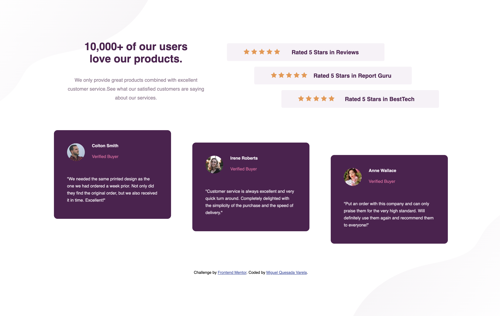

# Frontend Mentor - Social proof section solution

This is a solution to the [Social proof section challenge on Frontend Mentor](https://www.frontendmentor.io/challenges/social-proof-section-6e0qTv_bA). Frontend Mentor challenges help you improve your coding skills by building realistic projects.

## Table of contents

-   [Overview](#overview)
    -   [The challenge](#the-challenge)
    -   [Screenshot](#screenshot)
    -   [Links](#links)
-   [My process](#my-process)

    -   [Built with](#built-with)
    -   [What I learned](#what-i-learned)
    -   [Continued development](#continued-development)

-   [Author](#author)

## Overview

### The challenge

Users should be able to:

-   View the optimal layout for the section depending on their device's screen size

### Screenshot



### Links

-   Solution URL: [Add solution URL here](https://github.com/jmiguelqv/social-proof-section-challenge)
-   Live Site URL: [Add live site URL here](https://jmiguelqv.github.io/social-proof-section-challenge/)

## My process

### Built with

-   Semantic HTML5 markup
-   CSS custom properties
-   Flexbox
-   CSS Grid
-   Mobile-first workflow

### What I learned

-   flex and grid.

```css
.stars-container {
    display: flex;
    flex-direction: column;
    align-items: center;
    margin-bottom: 30px;
}
.stars {
    background-color: hsl(300, 24%, 96%);
    border-radius: 4px;
    margin: 8px 0;
    width: 330px;
    height: 80px;
    padding: 15px;
    font-weight: 700;
    color: hsl(300, 43%, 22%);
    display: flex;
    flex-direction: column;
    justify-content: space-between;
    align-items: center;
}

.cards {
    background-color: hsl(300, 43%, 22%);
    border-radius: 10px;
    max-width: 330px;
    height: 250px;
    padding: 37px;
    margin: 16px 24px 0px 24px;
    color: hsl(300, 24%, 96%);
    font-size: 12px;
    display: grid;
    grid-template-columns: 1fr 10fr;
}
.cards img {
    border-radius: 50%;
    width: 50px;
    margin-right: 20px;
    grid-column: 1 / 2;
    grid-row: 1 / 3;
}
```

-   how to start working with responsive designs.

```css
/* mayor a 768*/
@media only screen and (min-width: 768px) {
    body {
        background: url(../images/bg-pattern-top-desktop.svg),
            url(../images/bg-pattern-bottom-desktop.svg);
        background-repeat: no-repeat;
        background-position: top left, bottom right;
        background-size: 400px;
    }
    .stars {
        flex-direction: row;
        width: 444px;
        height: 50px;
        justify-content: center;
    }
    .cards-container {
        display: grid;
        grid-template-columns: 1fr 1fr;
    }
    .card-1 {
        grid-column: 1/2;
        justify-self: center;
    }
    .card-2 {
        grid-column: 2/3;
        justify-self: center;
    }
    .card-3 {
        grid-column: 1/3;
        grid-row: 2/3;
        justify-self: center;
    }
}
```

-   how to create an HTML structure.

```html
<div class="cards card-1">
    
    <span class="name">Colton Smith</span>
    <span class="status">Verified Buyer</span>
    <p>
        "We needed the same printed design as the one we had ordered a week
        prior. Not only did they find the original order, but we also received
        it in time. Excellent!"
    </p>
</div>
```

### Continued development

-   I need to practice more about flex and grid.

## Author

-   Frontend Mentor - [jmiguelqv](https://www.frontendmentor.io/profile/jmiguelqv)
-   LinkedIn - [jose miguel quesada varela](https://www.linkedin.com/in/jose-miguel-quesada-varela/)
-   Github - [jmiguelqv](https://github.com/jmiguelqv)
